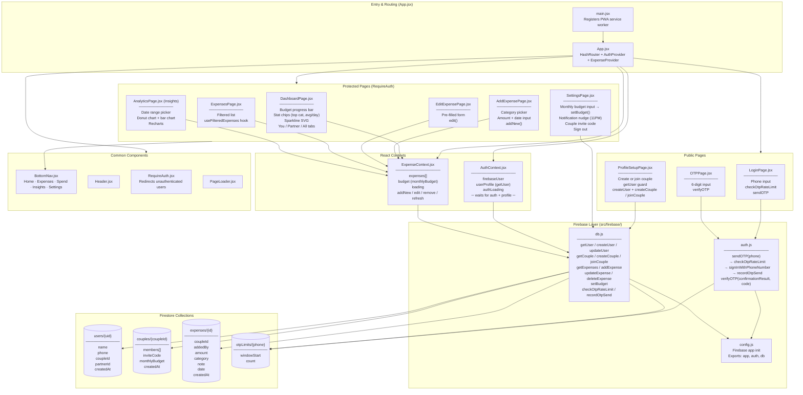

# Karcha 💸

> Expense tracker for couples — log, analyze, and manage shared spending together.

**Live App:** https://aguywithnojob.github.io/domanga/

---

## Table of Contents

1. [Features](#features)
2. [Tech Stack](#tech-stack)
3. [Architecture Diagram](#architecture-diagram)
4. [Project Structure](#project-structure)
5. [Firestore Schema](#firestore-schema)
6. [Step 1 — Firebase Project Setup](#step-1--firebase-project-setup)
7. [Step 2 — Enable Phone Authentication](#step-2--enable-phone-authentication)
8. [Step 3 — Create Firestore Database](#step-3--create-firestore-database)
9. [Step 4 — Get Firebase Config Keys](#step-4--get-firebase-config-keys)
10. [Step 5 — Clone & Install](#step-5--clone--install)
11. [Step 6 — Configure Environment Variables](#step-6--configure-environment-variables)
12. [Step 7 — Run Locally](#step-7--run-locally)
13. [Step 8 — Deploy to GitHub Pages](#step-8--deploy-to-github-pages)
14. [Step 9 — Add GitHub Pages Domain to Firebase](#step-9--add-github-pages-domain-to-firebase)
15. [Firestore Security Rules](#firestore-security-rules)
16. [How Couple Linking Works](#how-couple-linking-works)

---

## Features

- Phone OTP authentication — no password, no email
- OTP rate limiting — max 5 sends per phone per 24 hours (stored in Firestore)
- Link two accounts with a 6-digit couple invite code
- Add / edit / delete expenses by category, amount, date, and person
- 15 expense categories including Food, Travel, Rent, Credit Card, Car, Bike, Trip, and more
- Monthly budget — set a budget, track a live progress bar on the dashboard
- Dashboard with You / Partner / All tabs for recent expenses
- Stat chips — top spending category, average spend per day, week-over-week sparkline
- Monthly / weekly / custom date range analysis
- Category donut chart and per-person bar chart on Insights screen
- Filter and search expenses on the Expenses screen
- Fully mobile-optimized UI with emerald green theme
- PWA — installable on iPhone and Android, works offline (Workbox service worker)
- Completely serverless — Firebase handles auth, database, and rules
- Hosted free on GitHub Pages

---

## Tech Stack

| Layer | Tool |
|---|---|
| UI Framework | React 18 + Vite |
| Styling | Tailwind CSS v3 (custom emerald green palette) |
| Auth | Firebase Phone OTP |
| Database | Firebase Firestore |
| Charts | Recharts |
| Routing | React Router v6 (HashRouter) |
| PWA | vite-plugin-pwa + Workbox |
| Date Utils | date-fns |
| Font | Inter (Google Fonts) |
| Deploy | GitHub Pages via `gh-pages` |

---

## Architecture Diagram

The diagram below shows how React components, contexts, and Firestore collections connect.



---

## Project Structure

```
domanga/
├── public/
│   ├── favicon.svg
│   ├── icon-192.png          # PWA icon (generated)
│   └── icon-512.png          # PWA icon (generated)
│
├── src/
│   ├── main.jsx              # React entry point + PWA service worker registration
│   ├── App.jsx               # Root router (HashRouter), AuthProvider, ExpenseProvider
│   ├── index.css             # Global CSS, Tailwind base, karcha-bg colour
│   │
│   ├── components/
│   │   └── common/
│   │       ├── BottomNav.jsx     # 5-tab nav (Home, Expenses, Spend FAB, Insights, Settings)
│   │       ├── Header.jsx        # Page header bar
│   │       ├── PageLoader.jsx    # Full-screen spinner while auth resolves
│   │       ├── RequireAuth.jsx   # Route guard — redirects to / if not signed in
│   │       └── Spinner.jsx       # Reusable inline spinner
│   │
│   ├── contexts/
│   │   ├── AuthContext.jsx       # Provides firebaseUser, userProfile, authLoading
│   │   │                         # Waits for both onAuthStateChanged + getUser() before
│   │   │                         # setting loading=false (prevents reload flicker)
│   │   └── ExpenseContext.jsx    # Provides expenses[], budget, CRUD helpers
│   │                             # Fetches getExpenses + getCouple (for monthlyBudget)
│   │
│   ├── firebase/
│   │   ├── config.js             # Firebase app init, exports app / auth / db
│   │   ├── auth.js               # sendOTP (with rate-limit check), verifyOTP
│   │   └── db.js                 # All Firestore helpers:
│   │                             #   users: getUser, createUser, updateUser
│   │                             #   couples: getCouple, createCouple, joinCouple
│   │                             #   expenses: getExpenses, addExpense, updateExpense, deleteExpense
│   │                             #   budget: setBudget (writes monthlyBudget to couple doc)
│   │                             #   OTP limits: checkOtpRateLimit, recordOtpSend
│   │
│   ├── hooks/
│   │   └── useFilteredExpenses.js  # Filters expense list by person / category / date range
│   │
│   ├── pages/
│   │   ├── LoginPage.jsx         # Phone number entry, triggers sendOTP
│   │   ├── OTPPage.jsx           # 6-digit OTP inputs, calls verifyOTP
│   │   ├── ProfileSetupPage.jsx  # Name entry + create or join a couple (idempotent)
│   │   ├── DashboardPage.jsx     # Home: budget bar, stat chips, sparkline, tabbed expense list
│   │   ├── AddExpensePage.jsx    # Form to log a new expense ("Spend")
│   │   ├── EditExpensePage.jsx   # Pre-filled form to edit an existing expense
│   │   ├── ExpensesPage.jsx      # Scrollable filtered expense history
│   │   ├── AnalyticsPage.jsx     # "Insights" — donut + bar charts via Recharts
│   │   └── SettingsPage.jsx      # Budget setter, notification nudge, invite code, sign out
│   │
│   └── utils/
│       ├── categories.js         # 15 expense categories with emoji + colour tokens
│       └── formatUtils.js        # Currency formatter (₹ INR)
│
├── firestore.rules               # Firestore security rules (users, couples, expenses, otpLimits)
├── index.html                    # PWA meta tags, apple-touch-icon, theme-color #16a34a
├── tailwind.config.js            # Custom emerald green palette, reduced border-radius tokens
├── postcss.config.js
├── vite.config.js                # Vite + VitePWA plugin (manifest, Workbox, icons)
├── package.json
└── README.md
```

---

## Firestore Schema

### `users/{uid}`
| Field | Type | Description |
|---|---|---|
| `name` | string | Display name |
| `phone` | string | Phone number |
| `coupleId` | string \| null | Linked couple document ID |
| `partnerId` | string \| null | Partner's Firebase UID |
| `createdAt` | timestamp | Account creation time |

### `couples/{coupleId}`
| Field | Type | Description |
|---|---|---|
| `members` | string[] | Array of two UIDs |
| `inviteCode` | string | 6-character alphanumeric join code |
| `monthlyBudget` | number | Budget in INR (set from Settings) |
| `createdAt` | timestamp | Couple creation time |

### `expenses/{expenseId}`
| Field | Type | Description |
|---|---|---|
| `coupleId` | string | Parent couple ID |
| `addedBy` | string | UID of the person who added it |
| `amount` | number | Amount in INR |
| `category` | string | Category key (e.g. `food`, `rent`, `trip`) |
| `note` | string | Optional description |
| `date` | timestamp | Date of the expense |
| `createdAt` | timestamp | Record creation time |

### `otpLimits/{phoneDigits}`
| Field | Type | Description |
|---|---|---|
| `windowStart` | number | Unix ms timestamp of first OTP in current window |
| `count` | number | Number of OTPs sent in current 24h window (max 5) |

---

## Step 1 — Firebase Project Setup

1. Go to [https://console.firebase.google.com](https://console.firebase.google.com)
2. Click **"Add project"**
3. Name it `karcha` (or anything you prefer)
4. Disable Google Analytics (not needed) → Click **"Create project"**
5. Wait for the project to be created → Click **"Continue"**

---

## Step 2 — Enable Phone Authentication

1. In the Firebase Console sidebar, click **"Build"** → **"Authentication"**
2. Click **"Get started"**
3. Under **"Sign-in method"** tab, find **"Phone"** and click it
4. Toggle **"Enable"** → Click **"Save"**

> **Important:** Firebase Phone Auth requires a real phone number and will send actual SMS messages. For testing locally, you can add test phone numbers:
> - In Authentication → Sign-in method → Phone, scroll down to **"Phone numbers for testing"**
> - Add a test number like `+91 9999999999` with OTP `123456`
> - This avoids SMS charges during development

---

## Step 3 — Create Firestore Database

1. In the sidebar, click **"Build"** → **"Firestore Database"**
2. Click **"Create database"**
3. Choose **"Start in test mode"** (we'll add proper rules later)
4. Select a location closest to India — choose **`asia-south1` (Mumbai)** → Click **"Enable"**
5. Wait for the database to be provisioned

---

## Step 4 — Get Firebase Config Keys

1. In the Firebase Console, click the ⚙️ gear icon → **"Project settings"**
2. Scroll down to **"Your apps"** section
3. Click the **"</>"** (Web) icon to add a web app
4. Enter app nickname: `karcha-web` → Click **"Register app"**
5. You'll see a config object like this — **copy all the values**:

```js
const firebaseConfig = {
  apiKey: "AIza...",
  authDomain: "karcha-xxxxx.firebaseapp.com",
  projectId: "karcha-xxxxx",
  storageBucket: "karcha-xxxxx.appspot.com",
  messagingSenderId: "123456789",
  appId: "1:123456789:web:abcdef123456"
};
```

---

## Step 5 — Clone & Install

```bash
# Clone the repo
git clone https://github.com/aguywithnojob/domanga.git
cd domanga

# Install dependencies
npm install
```

---

## Step 6 — Configure Environment Variables

1. Copy the example env file:

```bash
cp .env.example .env.local
```

2. Open `.env.local` and fill in your Firebase config values:

```env
VITE_FIREBASE_API_KEY=AIza...
VITE_FIREBASE_AUTH_DOMAIN=karcha-xxxxx.firebaseapp.com
VITE_FIREBASE_PROJECT_ID=karcha-xxxxx
VITE_FIREBASE_STORAGE_BUCKET=karcha-xxxxx.appspot.com
VITE_FIREBASE_MESSAGING_SENDER_ID=123456789
VITE_FIREBASE_APP_ID=1:123456789:web:abcdef123456
```

> `.env.local` is gitignored — your keys will never be committed to GitHub.

---

## Step 7 — Run Locally

```bash
npm run dev
```

Open [http://localhost:5173](http://localhost:5173) in your browser.

**Note:** Phone OTP requires `localhost` to be an authorized domain. It is automatically allowed by Firebase for local development.

---

## Step 8 — Deploy to GitHub Pages

1. Make sure your GitHub repo is named `domanga` and `main` branch exists
2. Run:

```bash
npm run deploy
```

This command:
- Builds the app with `vite build`
- Pushes the `/dist` folder to the `gh-pages` branch
- GitHub Pages serves it from `https://aguywithnojob.github.io/domanga/`

3. In your GitHub repo → **Settings** → **Pages**:
   - Source: **Deploy from a branch**
   - Branch: **gh-pages** → **/ (root)**
   - Click **Save**

Your app will be live in 1-2 minutes.

---

## Step 9 — Add GitHub Pages Domain to Firebase

After deploying, you must whitelist your GitHub Pages URL in Firebase Auth:

1. Go to Firebase Console → **Authentication** → **Settings** tab
2. Under **"Authorized domains"**, click **"Add domain"**
3. Add: `aguywithnojob.github.io`
4. Click **"Add"**

Without this step, phone OTP will fail on the live site.

---

## Firestore Security Rules

After testing, replace the default test rules with these secure rules:

In Firebase Console → Firestore → **Rules** tab, paste:

```
rules_version = '2';
service cloud.firestore {
  match /databases/{database}/documents {

    // Users can only read/write their own profile
    match /users/{userId} {
      allow read, write: if request.auth != null && request.auth.uid == userId;
    }

    // Couples: only members can read/write
    match /couples/{coupleId} {
      allow read: if request.auth != null;
      allow write: if request.auth != null &&
        (resource == null || request.auth.uid in resource.data.members);
    }

    // Expenses: only couple members can read/write
    match /expenses/{expenseId} {
      allow read, write: if request.auth != null &&
        request.auth.uid in get(/databases/$(database)/documents/couples/$(resource.data.coupleId)).data.members;
      allow create: if request.auth != null;
    }
  }
}
```

Click **"Publish"**.

---

## How Couple Linking Works

1. **Person A** signs in with their phone number → completes profile setup
2. Person A gets a **6-digit couple invite code** (shown in Settings)
3. **Person B** signs in → on Profile Setup screen, enters Person A's invite code
4. Both are now linked under the same `coupleId`
5. All expenses added by either person are visible to both

> If you want to unlink and re-link, use the Settings screen.

---

---

## Currency

All amounts are displayed in **Indian Rupees (₹ INR)**.

---

## License

MIT
