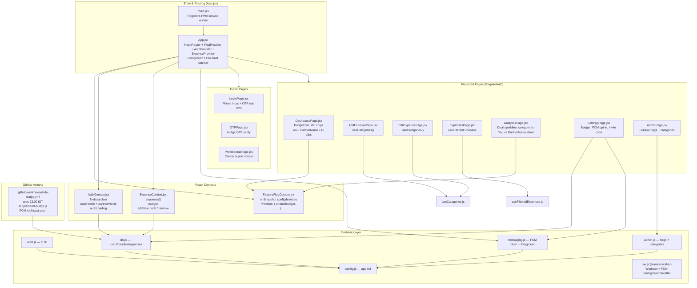

# Karcha 💸

> Expense tracker for couples — log, analyze, and manage shared spending together.

**Live App:** https://aguywithnojob.github.io/domanga/

---

## Table of Contents

1. [Features](#features)
2. [Tech Stack](#tech-stack)
3. [Architecture Diagram](#architecture-diagram)
4. [Project Structure](#project-structure)
5. [Step 1 — Clone & Install](#step-1--clone--install)
6. [Step 2 — Run Locally](#step-2--run-locally)
7. [Step 3 — Enable Push Notifications](#step-4--enable-push-notifications)
8. [Firestore Security Rules](#firestore-security-rules)
9. [How Couple Linking Works](#how-couple-linking-works)

---

## Features

- Phone OTP authentication — no password, no email
- OTP rate limiting — max 5 sends per phone per 24 hours (stored in Firestore)
- Link two accounts with a 6-digit couple invite code
- Add / edit / delete expenses by category, amount, date, and person
- Dynamic category list — enable/disable built-in categories, add custom ones via Admin panel
- Monthly budget — set a budget, track a live progress bar on the dashboard
- Dashboard with You / [Partner name] / All tabs — shows partner's real name everywhere
- Stat chips — Today's total and week-over-week sparkline
- Budget sparkline on Insights — dual line showing your spend vs partner's spend per day
- Monthly / weekly / custom date range analysis on Insights screen
- Category breakdown bar list and You vs Partner chart on Insights
- Filter and search expenses on the Expenses screen
- **Real-time sync** — both users' screens update instantly when an expense is added, edited, or deleted (Firestore `onSnapshot`)
- **Offline-first** — add expenses with no internet; changes queue in IndexedDB and sync automatically on reconnect
- **In-app notification inbox** — last 5 push notifications with timestamps, red dot badge, clear all
- **Admin panel** (`/admin`) — manage feature flags and categories from Firestore without redeploying
- **Feature flags** — toggle app features on/off from Firestore in real time
- **FCM push notifications** — real banner notifications + daily 11 PM nudge via GitHub Actions cron
- Fully mobile-optimized UI with emerald green theme
- PWA — installable on iPhone and Android via Settings → Install App button
- Completely serverless — Firebase handles auth and database
- Hosted free on GitHub Pages

---

## Tech Stack

| Layer | Tool |
|---|---|
| UI Framework | React 18 + Vite |
| Styling | Tailwind CSS v3 (custom emerald green palette) |
| Auth | Firebase Phone OTP |
| Database | Firebase Firestore (real-time `onSnapshot`) |
| Offline Storage | Firestore IndexedDB persistent cache (`persistentLocalCache`) |
| Push Notifications | Firebase Cloud Messaging (FCM) |
| Charts | Recharts (bar chart) |
| Routing | React Router v6 (HashRouter) |
| PWA | vite-plugin-pwa + Workbox (injectManifest strategy) |
| Date Utils | date-fns |
| Font | Inter (Google Fonts) |
| Deploy | GitHub Pages via `gh-pages` |
| Daily Nudge | GitHub Actions cron + `firebase-admin` |

---

## Architecture Diagram



---

## Project Structure

```
domanga/
├── public/
│   ├── favicon.svg
│   ├── icon-192.png              # PWA icon
│   └── icon-512.png              # PWA icon
│
├── scripts/
│   └── send-nudge.js             # Daily push via firebase-admin (runs in GitHub Actions)
│
├── .github/
│   └── workflows/
│       └── daily-nudge.yml       # Cron: 23:00 IST — sends FCM nudge to all opted-in devices
│
├── src/
│   ├── main.jsx                  # Entry point + PWA service worker registration
│   ├── sw.js                     # Custom service worker: Workbox precache + FCM background handler
│   ├── App.jsx                   # Root router + foreground FCM toast overlay
│   ├── index.css
│   │
│   ├── components/common/
│   │   ├── BottomNav.jsx
│   │   ├── Header.jsx
│   │   ├── PageLoader.jsx
│   │   ├── RequireAuth.jsx
│   │   └── Spinner.jsx
│   │
│   ├── contexts/
│   │   ├── AuthContext.jsx       # userProfile + partnerProfile (fetched by partnerId)
│   │   ├── ExpenseContext.jsx
│   │   └── FeatureFlagContext.jsx
│   │
│   ├── firebase/
│   │   ├── config.js             # Firebase app init — exports app, auth, db
│   │   ├── auth.js               # sendOTP + verifyOTP (with rate limiting)
│   │   ├── db.js                 # Firestore helpers: users, couples, expenses, budget, OTP
│   │   ├── admin.js              # Feature flag + category helpers
│   │   └── messaging.js          # subscribePush (saves FCM token), onForegroundMessage
│   │
│   ├── hooks/
│   │   ├── useCategories.js      # Merges static + Firestore custom; filters disabled
│   │   └── useFilteredExpenses.js
│   │
│   ├── pages/
│   │   ├── LoginPage.jsx
│   │   ├── OTPPage.jsx
│   │   ├── ProfileSetupPage.jsx
│   │   ├── DashboardPage.jsx
│   │   ├── AddExpensePage.jsx
│   │   ├── EditExpensePage.jsx
│   │   ├── ExpensesPage.jsx
│   │   ├── AnalyticsPage.jsx
│   │   ├── SettingsPage.jsx
│   │   └── AdminPage.jsx
│   │
│   └── utils/
│       ├── categories.js         # 15 built-in categories with emoji + colour tokens
│       └── formatUtils.js        # ₹ INR formatter, date helpers
│
├── firestore.rules
├── .env.example                  # Template for environment variables
├── index.html
├── tailwind.config.js
├── vite.config.js                # Vite + VitePWA (injectManifest strategy)
├── package.json
└── README.md
```

---

## Step 1 — Clone & Install

```bash
git clone https://github.com/aguywithnojob/domanga.git
cd domanga
npm install
```

Create your local env file:

```bash
cp .env.example .env.local
```

Fill in `.env.local` with the Firebase config values from **Firebase Console → Project Settings → Your apps**.

---

## Step 2 — Run Locally

```bash
npm run dev
```

Open [http://localhost:5173](http://localhost:5173).

---

## Step 3 — Enable Push Notifications

### A. VAPID key

1. Firebase Console → **Project Settings → Cloud Messaging**
2. Scroll to **"Web configuration"** → **"Generate key pair"**
3. Copy the key → add to `.env.local`:
   ```env
   VITE_FIREBASE_VAPID_KEY=your_vapid_key_here
   ```
4. Redeploy: `npm run deploy`

### B. GitHub Actions secret (daily 11 PM nudge)

1. Firebase Console → **Project Settings → Service accounts → Generate new private key** → download JSON
2. GitHub repo → **Settings → Secrets and variables → Actions → New repository secret**
   - Name: `FIREBASE_SERVICE_ACCOUNT`
   - Value: paste the full content of the downloaded JSON
3. Click **"Add secret"**

The workflow runs daily at **23:00 IST** and sends an FCM push to every opted-in device.

> **Platform support:** Android and Chrome desktop. iOS requires 16.4+ with the PWA installed.

---

## Currency

All amounts are displayed in **Indian Rupees (₹ INR)**.

---

## License

MIT
